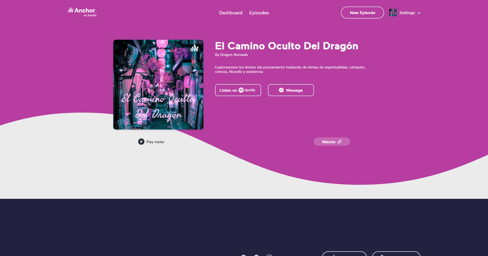

# El Camino Oculto del Dragón (podcast)

By [Dragón Nómada](dragonnomada.medium.com)

## Introducción

Este es el podcast **El Camino Oculto Del Dragón** disponible en [anchor.fm/dragon-nomada](https://anchor.fm/dragon-nomada)

## Presentación

Bienvenidos al Camino Oculto del Dragón, yo soy Dragón Nómada. Aquí hablaremos de espiritualidad, cómputo, ciencia, filosofía y existencia 
Adelante, viajemos juntos en este sendero del conocimiento. Exploremos los límites de la realidad, la percepción y la existencia.

Gracias por acompañarme.

## Noticias

* **26 de agosto de 2021** - Damos la bienvenida a todos a este nuevo proyecto, pronto publicaremos una serie de episodios interesantes sobre la realidad, el cómputo y la espiritualidad. ¡No se lo pierdan!

## Acerca de este podcast

Estoy orgulloso de presentar este nuevo proyecto llamado *El Camino Oculto del Dragón*. Mi nombre es Alan Badillo Salas, mejor conocido como Dragón Nómada. Agradezco que puedan acompañarme en esta aventura al conocimiento más sensible de la humanidad, para así explorar los límites de la existencia.
